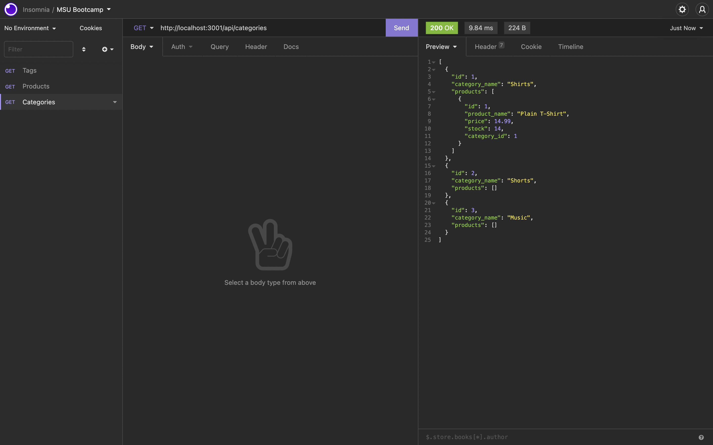

# E-commerce Back End

## Table of Contents
 * [Description](#Description)
 * [Installation](#Installation)
 * [Usage](#Usage)
 * [Contribution](#Contribution)
 * [License](#License)
 * [Questions](#Questions)

## Description
E-commerce Back End is an application that was made to utilize sequelize as an ORM to create and maintian an e-commerce database. Using sequelize and the middle man between javascript and mysql, one is able to create tables using object oriented programming and use sequelize methods to query the mysql database. This reduces the need to be switching back and forth between languages.

## Built With
 * JavaScript
 * Node
 * Mysql2
 * Express.js
 * Sequelize

## ScreenShot

## Installation
To install the application, download the code base from the applications repository https://github.com/omcewan/e-commerce-orm. Then your systems terminal/bash shell, run the command, npm install or npm i (shorten version) to download all the packages needed for the application.

## Usage
Upon downloaded the dependencies for the application you will need to log into mysql and create the database. This can be done by typing the command 'source db/db.sql'. This will create the database. Then you will need to seed the tables and data. To do this log out of mysql and then run the command npm run seeds. This will popluate data to the tables. You can now start the application using the command npm start where you can make queries.

## Contribution
To contribute to this application please for the application from the GitHub repository above, where you can work on the changes you would like to implement and then submit a pull request. 

## License
This application is covered under the MIT.
For more details about licensing, use this link: https://choosealicense.com/licenses/mit/.

## Questions
For additional information about the project, please find it at the following www.github.com/omcewan.
Also if you have additional questions please contact me at omcewan18@gmail.com.
